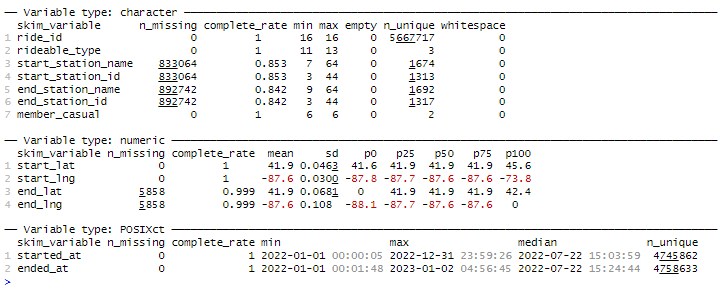
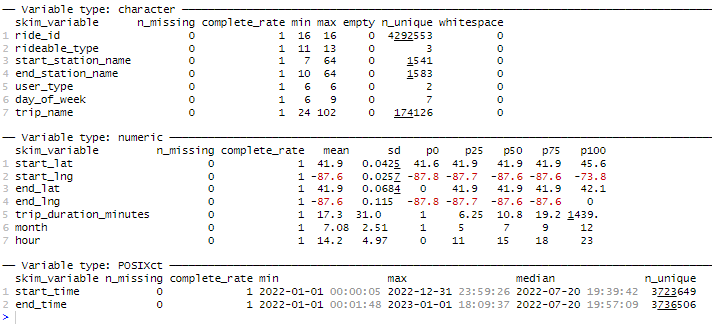
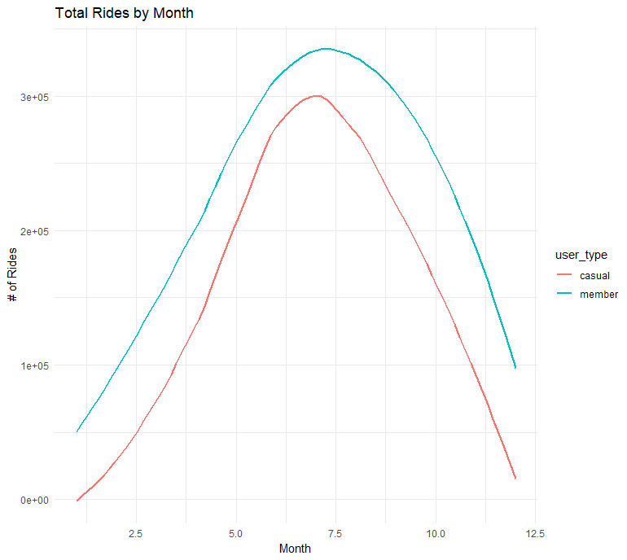
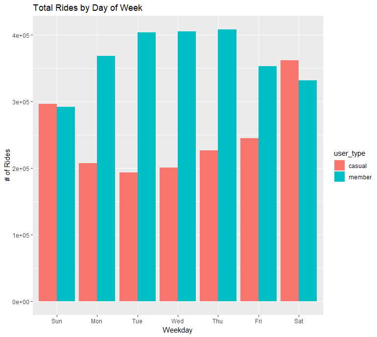
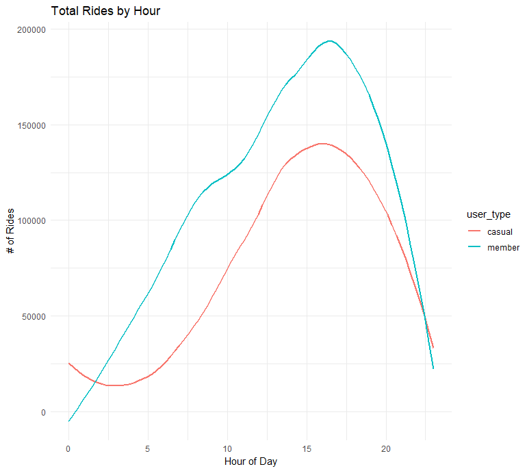
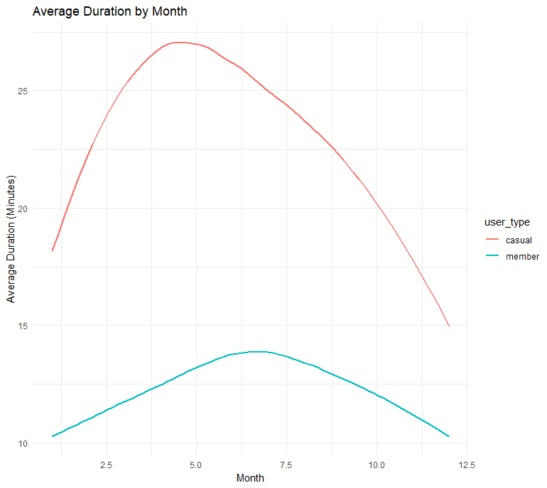
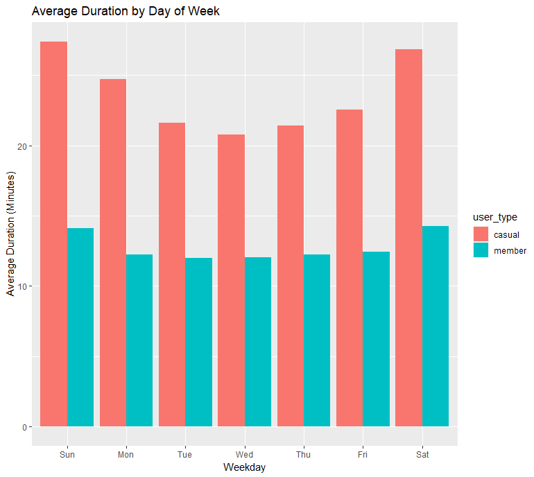
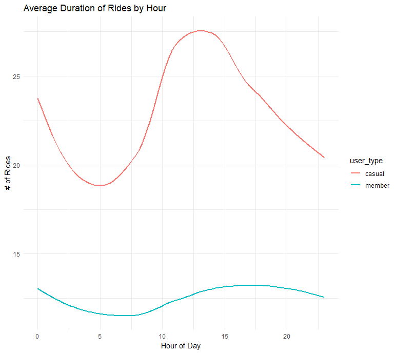

# Cyclistic-Bike-Share-Data-Case-Study

This Project is the Capstone project of the Google Data Analytics Career Certificate. The project brings together all of the key skills learned in the course to perform a case study on real world data. 

The Project walks us through the general structure of analytics as per the course: 

1. Ask
2. Prepare
3. Process
4. Analyze
5. Share 
6. Act

For all of the background information on the scenario, please see the file titled 'DA-C8-Case-Study-1-PDF'. 

For a full R-Markdown Notebook of the analysis, please see the file 'Cyclistic Notebook.PDF'

# Context

## Scenario

You are a junior data analyst working in the marketing analyst team at Cyclistic, a bike-share company in Chicago. The director of marketing believes the company’s future success depends on maximizing the number of annual memberships. Therefore, your
team wants to understand how casual riders and annual members use Cyclistic bikes differently. From these insights, your team will design a new marketing strategy to convert casual riders into annual members. But first, Cyclistic executives must approve your
recommendations, so they must be backed up with compelling data insights and professional data visualizations.

## Cyclistic


In 2016, Cyclistic launched a successful bike-share offering. Since then, the program has grown to a fleet of 5,824 bicycles that are geotracked and locked into a network of 692 stations across Chicago. The bikes can be unlocked from one station and returned to any other station in the system anytime.
Until now, Cyclistic’s marketing strategy relied on building general awareness and appealing to broad consumer segments. One approach that helped make these things possible was the flexibility of its pricing plans: single-ride passes, full-day passes, and
annual memberships. Customers who purchase single-ride or full-day passes are referred to as casual riders. Customers who purchase annual memberships are Cyclistic members. 

Cyclistic’s finance analysts have concluded that annual members are much more profitable than casual riders. Although the pricing flexibility helps Cyclistic attract more customers, Moreno believes that maximizing the number of annual members will be key to
future growth. Rather than creating a marketing campaign that targets all-new customers, Moreno believes there is a very good chance to convert casual riders into members. She notes that casual riders are already aware of the Cyclistic program and have
chosen Cyclistic for their mobility needs.

Moreno has set a clear goal: Design marketing strategies aimed at converting casual riders into annual members. In order to do that, however, the marketing analyst team needs to better understand how annual members and casual riders differ, why casual
riders would buy a membership, and how digital media could affect their marketing tactics. Moreno and her team are interested in analyzing the Cyclistic historical bike trip data to identify trends.

Three questions will guide the future marketing program:
1. How do annual members and casual riders use Cyclistic bikes differently?
2. Why would casual riders buy Cyclistic annual memberships?
3. How can Cyclistic use digital media to influence casual riders to become members?

## Step 1: Ask 

I was assigned to answer the first question: How do annual members and casual riders use Cyclistic bikes differently?

The key deliverable for this phase is identifying the key stakeholders and determing what the business task is. 

### Key Stakeholders: 
##### Lily Moreno
  As the director of the marketing analytics team and the one assigning this task to us, Lily is the primary stakeholder in this assignment. This means we need to   consider her goals of understanding the data to maximize number of members

##### Executive Team
  The executive team will make the final decision on the proposed strategy, which means the analysis will have to pass their inspection. As they are detail          oriented, it will be important to make sure the analysis is robust and correct. 

##### Marketing Analytics Team:
  The team that collects and analyzes the provided data, who may be curious about new insights discovered. 

##### End-Users
  The results of this analysis and the recommendations at the end may impact how Cyclistic offers its services. It is important to keep the users in mind when       making any changes as we want to ensure the end result improves their experience.

### Business task
 Analyze and identify the key differences in usage of Cyclistic bikes between Annual Members and Casual Riders. 


## Step 2: Prepare

_You will use Cyclistic’s historical trip data to analyze and identify trends. Download the Cyclistic trip data here. (Note: The datasets
have a different name because Cyclistic is a fictional company. For the purposes of this case study, the datasets are appropriate
and will enable you to answer the business questions. The data has been made available by Motivate International Inc. under this
license.) You can choose to work with an entire year of data, or just one quarter of a year. If you are working in Google Sheets, there
are some files that might be too large to view. This is public data that you can use to explore how different customer types are using
Cyclistic bikes. But note that data-privacy issues prohibit you from using riders’ personally identifiable information. This means that
you won’t be able to connect pass purchases to credit card numbers to determine if casual riders live in the Cyclistic service area or
if they have purchased multiple single passes._

#### The Data
  The data has been made available by Motivate International Inc. The license can be found [here.](https://divvybikes.com/data-license-agreement) 
  
  The data provided comes seperated by month for the entirety of 2022. You can access and download the data [here.](https://divvy-tripdata.s3.amazonaws.com/index.html)
  
  This data meets the ROCCC standards, as the data comes directly from the company that owns the bikes and collects the data. It is current as it is from the year that we are analyzing and it is unbiased as all rides are being reported. The data is well organized and relatively clean. 

## Step 3: Process

*Then, process your data for analysis.*

#### Key tasks: 
1. Check the data for errors.
2. Choose your tools.
3. Transform the data so you can work with it effectively.
4. Document the cleaning process.

Early checks were done in excel, ensuring that the data was largely complete and uniform. For the rest of the analysis, I used R, as SQL would not allow me to upload the amount of data I needed to complete my analysis. 

I verified the condition of the dataset using the below functions: 

```{r Combining Raw Data and Early Statistics, results ='hide', warning = FALSE, echo = FALSE}
# Combining the data to get the entire year
all_trips_data <- rbind(january,february,march,april,may,june,july,august,september,
                  october,november,december)

colnames(all_trips_data)  #List of column names
nrow(all_trips_data)  #How many rows are in data frame?
dim(all_trips_data)  #Dimensions of the data frame?
head(all_trips_data)  #See the first 6 rows of data frame.  Also tail(qs_raw)
str(all_trips_data)  #See list of columns and data types (numeric, character, etc)
summary(all_trips_data)  #Statistical summary of data. Mainly for numerics
skim_without_charts(all_trips_data)
```


This revealed four key problems: 

1.  The data can only be aggregated at the ride-level, which is too granular. We will to add some additional columns data such as weekday and month.
2.  We will want to add a calculated field for length of ride since none of the data has a "tripduration" column.
3.  There are some rides where trip duration shows up as negative, including several hundred rides where Divvy took bikes out of circulation for Quality control reasons. We will want to delete these rides.
4. The Start and End station columns are missing from some datapoints. This impacts ~15% of the data.

Starting with the feature engineering, I added the trip duration as well as a few extra features that helped me get better understandings of the data and organize it into different groups for analysis. 

```{r Feature Engineering, message = FALSE, results ='hide'}
# Adding new features 

all_trips_data$trip_duration_minutes <- round(as.numeric(difftime(all_trips_data$ended_at, all_trips_data$started_at, units = "mins")), 2) # Duration of trip
all_trips_data$day_of_week <- weekdays(all_trips_data$started_at) # Day that ride started at
all_trips_data$month <- month(all_trips_data$started_at) # Month that ride started at
all_trips_data$hour <- hour(all_trips_data$started_at) # Hour that ride started at
all_trips_data$trip_name <-    ifelse(all_trips_data$start_station_name == all_trips_data$end_station_name,
                                       paste("Round Trip from", all_trips_data$start_station_name),
                                       paste(all_trips_data$start_station_name, "to", all_trips_data$end_station_name)) # Trip route name
```

To deal with issues three and four, I filtered out all of the void data based on the trip_duration feature. The data was filtered to only include trips that lasted more than a minute and less than a full day. I also dropped all columns missing values:

```{r Cleaning Data, message = FALSE, results ='hide'}
all_trips_data <- all_trips_data %>% 
  drop_na() %>% #drop rows with missing values
  filter(trip_duration_minutes >= 1, trip_duration_minutes <= 1440) #Set trip duration limits
```

The missing data could have been caused by a variety of factors, but it is impossible to say exactly why. Here are some thoughts: 

1. Ride cancellations. It is possible users started a ride by accident but never unlocked the bike and cancelled it immediately.
2. Riders leaving a bike somewhere without docking it. In my experience with bike shares, this is an option but it incurs a fee. 
3. Data collection error. The bike or docking system may have broken and the data was not recorded.

Finally, the data was ready for analysis and this was verified by again using the skim_without_charts() function:



Our final dataset has a size of 4,292,553 rows compared to the raw data which was 5,667,717 rows long. The final dataset is ~75.7% of the original data which is more than enough to have confidence in our analysis. 

## Step 4: Analyze

*Now that your data is stored appropriately and has been prepared for analysis, start putting it to work.*

In the analysis portion, I organized, formatted and aggregated the data before looking into some statistics to understand the story the data was starting to tell. Applying some basic statistical methods on the trip duration and the number of rides resulted in the following table. (All units in Minutes)

| User Type  | Mean | Median | Maximum | Minimum | Mode (Day) |
| ------------- | ------------- | ------------- | ------------- | ------------- | ------------- |
| Casual  |  24.07184  | 14.08  | 1439.37  | 1  | Saturday  |
| Member  | 12.67272 | 9.15  | 1436.33  |  1  | Wednesday |

Summary: 

It started to become clear that there were some key differences about how and when these two types of riders used Cyclistic, noticeably in the day of week most frequently travelled and the average duration of trips. Not only this, but when in the day different riders were using the service also provided some insights into how they were using Cyclistic.

| Casual  |  Member | 
| ------------- | ------------- | 
| Rideship Increased on Weekends|  Ridership Increased on Weekdays |  
| ------------- | ------------- | 
| Ride Duration was 24 Minutes on average | Rides duartion was 12 minutes on average |
| ------------- | ------------- | 
| Stations used more near parks, recreational areas | Times used were much higher 6AM-5PM, implies commuting|
| ------------- | ------------- | 

The abvove inights allowed for a much clearer picture of the two main types of users, creating a profile. 

The casual rider typically is using cyclsitic as a leisurely activity or to travel far distances. They ride more frequently in odd hours and on the weekends than members. This leads me to believe that a lot of these casual users may be visiting Chicago and not actually residing within the city. 

Members on the other hand use the service disproportionatly more during commuting hours than any other time of day. This is also true for the fact that their ridership is much higher on weekdays in general. For members, it seems they are using the bike as a form of transportation to and from work. 

These profiles derived from the data are what informed the reccomendations to the marketing team in Step 6: Act

## Step 5: Share

Now that you have performed your analysis and gained some insights into your data, create visualizations to share your findings.
Moreno has reminded you that they should be sophisticated and polished in order to effectively communicate to the executive
team.

After brainstorming how to visualize the given data, I started with comparing the number of rides taken by each customer group across the months, days of the week and hours of the day. These plots were generated in R and can be seen below. 




I then decided to look at the same timeframes but change the y value to the average duration of rides over these timeframes. 





I also created a Tableau dashboard to map the data and create a more cohesive report of the data visualizations. 

---------------------------------
WIP
--------------------------------

## Step 6: Act
*Now that you have finished creating your visualizations, act on your findings. Prepare the deliverables Morena asked you to create,
including the three top recommendations based on your analysis.*

## *Recommendations*

#### **1. Implementing Seasonal Passes.**

Ridership varies greatly season to season. When the winter approaches, the number of rides decreases drastically. In this case, people may believe a membership to be a waste as they will just have to cancel it when they stop using the service over the winter season. If Cyclistic implemented a Seasonal Pass, it may drive casual users to purchase the membership for the summer months, and may convert them to full membership if they enjoy the benefits of having a membership. 

#### **2. Marketing according to the userbase.**

From the data and the maps in the tableau dashboard, it is clear that members and casuals use different stations. The stations most frequented by members should have advertisements nearby promoting the benefits of a membership. Conversely, the stations identified as used more by casual users should have sign up offers around them to encourage new members. 


#### **3. Targeting Daily Commuters**

A good way to increase membership would be to show the benefits of using Cyclistic for their commute. Focusing on the difficulties of using other methods of transportation and the ease of use of the Cyclistic systems for getting to and from work would likely increase member signups. These ads should be shown to users that frequently use stations that other members use. The stations near businesses would likely get the most attention of potential member signups. 

You could place these in subways, buses, trains or any other method of transportation that commuters typically take to work. 

### **Conclusion**

Overall, the analysis went well. The data was adequately processed and analyzed allowing for some key insights to be discovered. With this new information, we have a much better understanding of the overall user base for Cyclistic and how they use it. We understand that members are more likely to use it commuting to and from work, whereas casuals seem to use it for pleasure. 

Cyclistic would be able to leverage this analysis to develop and enact a new marketing strategy centered around increasing members. 

All in all, this was a great opportunity to leverage the technical skills learned through the course and put them all together in a final project.

### **Next Steps**

I wanted to tackle some additional ideas I had that were just outside of the scope of this project, but could provide more impactful insights and actions. There are some features pertaining to user identity that were purposefully excluded from the dataset for privacy issues. I believe this data surrounding who exactly is using the service would be incredibly useful.  

First off, it may have been beneficial to look into individual rider profiles. Looking at the difference between members and casual riders to determine how many rides the average casual vs. member 

Secondly, The payment information from the customers will likely provide an address and town of residence. It would be worthwhile to determine how many of these casual riders actually reside near Chicago. If they are visiting from out of state, it is unlikely that they would be willing to sign up for long term memberships as they wouldn't be a frequent user. That being said, I would use this information to better tailor the ads these users are seeing as it would make sense to push seasonal or week passes to people visiting the city as they are very unlikely to  

# How to Install and Access

You can download the R code in the repository and it should run provided:
1) You have installed all the packages included in the analyses
2) You have downloaded all of the datasets (January-December 2022) and stored them in the same directory. 
